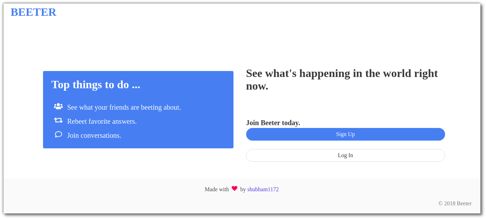
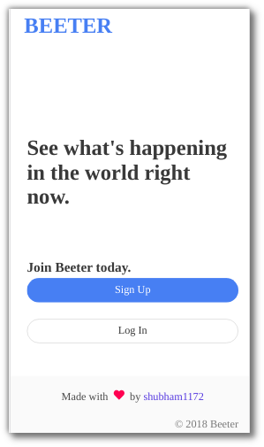
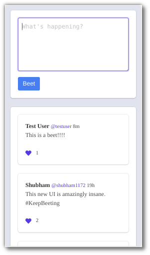

<h1 align="center"> BEETER </h1>    
    
<p align="center">    
  
 
   
 </p>   
 
## What is it?  

A platform to beet your feelings and see what other people are beeting about.
<br> <br>
Back-end -> Node, Express, Passport and Mongoose. <br>
Database -> MongoDB. <br>
Front-end -> Bulma in Embedded JavaScript.   
   
   
## Install 
``` 
$ git clone https://github.com/shubham1172/beeter
$ cd beeter
$ npm install 
``` 

**NOTE:** you can set the env variable `PORT` to run the app on a particular port. Default is `8080`. <br>

To run, 
``` 
$ npm start
``` 

## Contributing    
This project is suitable for developers who want to start contributing to open source. You can open up issues and send pull requests.
